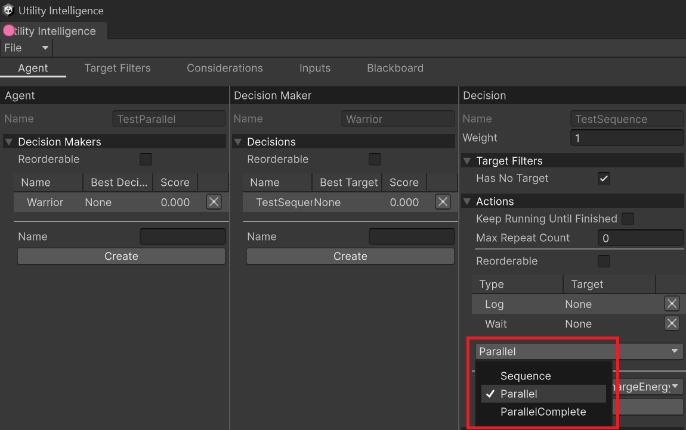
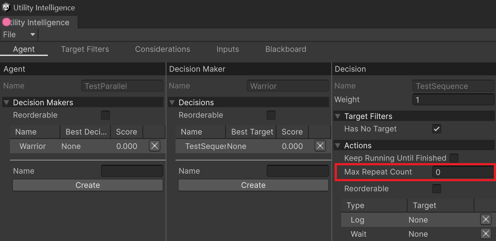
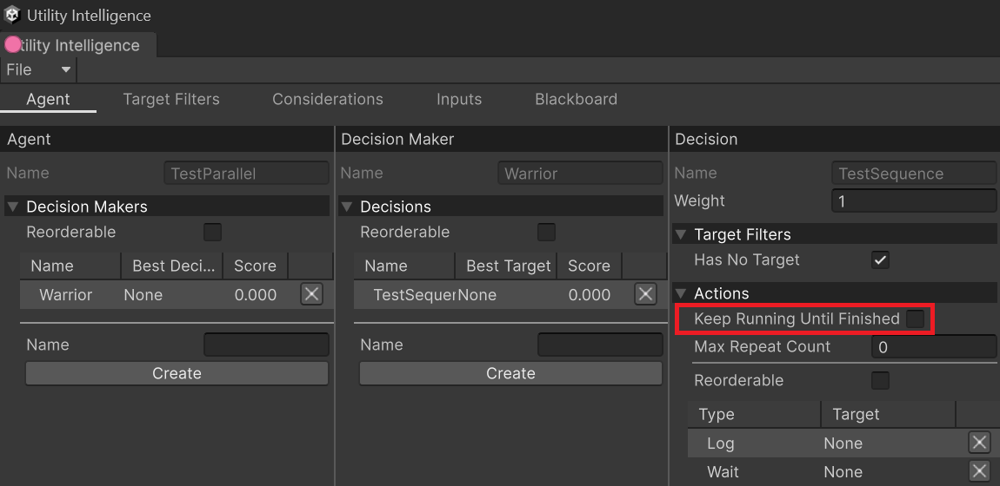
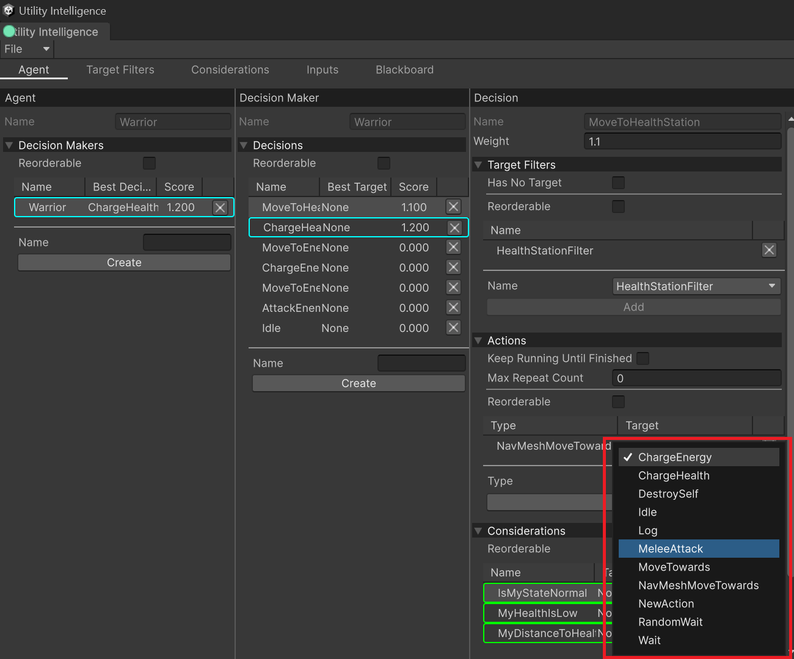

Action Tasks are tasks that the agent has to execute if the attached decision has been selected. They are executed either in sequence or in parallel, depending on the execution mode of the action list.

# Execution Modes

After the agent finds out the best decision, it will execute the action list either in **sequence** or in **parallel**, depending on your choice. Currently, there are two execution modes for the action list:
- **Sequence**
	- The actions will be run sequentially. 
	- If an action finishes in success, the agent will run the next action, and the action list will finish in success if the last action finishes in success.
	- If an action finishes in failure, the action list will finish in failure.
- **Parallel**
	- The actions will be run simultaneously. 
	- The action list will finish in success if all actions are finished in success.
	- If any action finishes in failure, other actions will be aborted and the action list will finish in failure.
- **ParallelComplete**
	- The actions will be run simultaneously. 
	- If any action finishes in success or failure, other actions will be aborted and the action list will return the child status immediately.

You can choose the execution mode you want by selecting it from this drop down menu:


# MaxRepeatCount

It is the number of times to repeat the action list. 

> [!NOTE]
> - The action list only repeat if it is finished in success.
> - If `MaxRepeatCount` <= 0 it will be repeated forever

You can change `MaxRepeatCount` of the action list here:



# Keep Running Until Finished
In case you want to prevent the current agent from making a new decision while the action list is running, you can check the option: **Keep Running Until Finished** in the **Action List Editor**. 

For example, it can be used with the attack action because the agent needs to finish the attack before starting the next action, such as run away from the enemy. 



# Creating Action Tasks

1. To create a new action task, you need to create a new class inherited from `ActionTask`:
	```cs
    public class Wait : ActionTask
    {
        private float elapsedTime;
        public VariableReference<float> WaitTime = 1.0f;

        protected override void OnStart()
        {
            elapsedTime = 0;
        }

        protected override UpdateStatus OnUpdate(float deltaTime)
        {
            elapsedTime += deltaTime;

            if (elapsedTime > WaitTime) return UpdateStatus.Success;
            return UpdateStatus.Running;
        }
    }
	```
1. To assign the action task to a decision, you need to go the the **Action List Editor** in the **Agent Tab**, select the action type, then click the **Create** button:


# Built-in Action Tasks

Currently, **Utility Intelligence** provides these buit-in action tasks:
- Idle
- Log
- Wait
- RandomWait
- MoveTowards
- NavmeshMoveTowards
- DestroySelf


# Overridable Functions
Here is the list of functions you could override to make your actions works as you want:
- **Lifecycle Functions**:
	```cs
	void OnAwake();
	
	void OnStart();
	
	Status OnUpdate();
	
	void OnLateUpdate();
	
	void OnFixedUpdate();
	
	//OnAbort is called when the action's target changes or when the agent makes a new decision
	void OnAbort();
	
	//OnEnd is called after the action returns a success or failure
	void OnEnd();
	```
- **Collision/Trigger 3D**:
	```cs
	void OnCollisionEnter(Collision collision);
	
	void OnCollisionStay(Collision collision);
	
	void OnCollisionExit(Collision collision);
	
	void OnTriggerEnter(Collider other);
	
	void OnTriggerStay(Collider other);
	
	void OnTriggerExit(Collider other);
	
	void OnControllerColliderHit(ControllerColliderHit hit);
	```
- **Collision/Trigger 2D**:
	```cs
	void OnCollisionEnter2D(Collision2D collision);
	
	void OnCollisionStay2D(Collision2D collision);
	
	void OnCollisionExit2D(Collision2D collision);
	
	void OnTriggerEnter2D(Collider2D other);
	
	void OnTriggerStay2D(Collider2D other);
	
	void OnTriggerExit2D(Collider2D other);
	```
- **Animation**:
	```cs
	void OnAnimatorMove();
	
	void OnAnimatorIK(int layerIndex);
	```

# Coroutine functions

- We provides these functions to help you start/stop coroutines from action tasks:
	```cs
	void StartCoroutine(string methodName);
	
	Coroutine StartCoroutine(IEnumerator routine);
	
	Coroutine StartCoroutine(string methodName, object value);
	
	void StopCoroutine(string methodName);
	
	void StopCoroutine(IEnumerator routine);
	
	void StopAllCoroutines();
	```