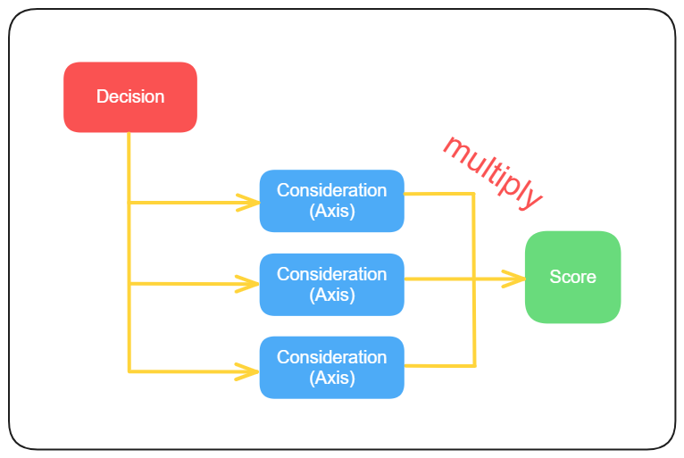
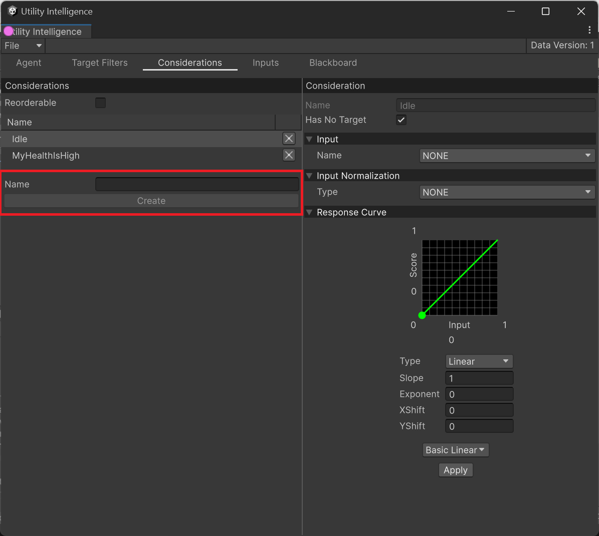
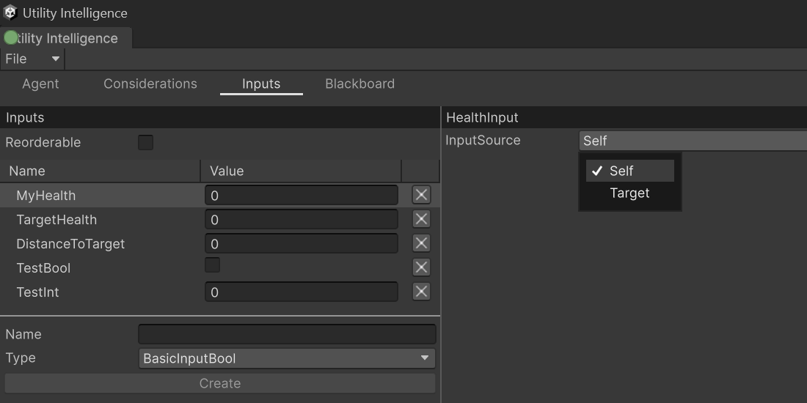
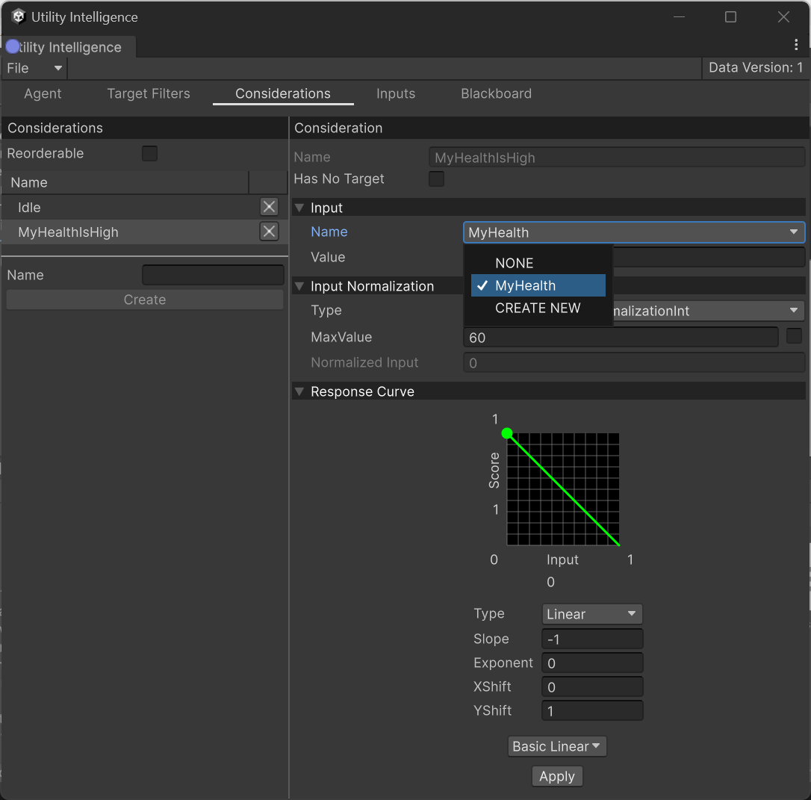
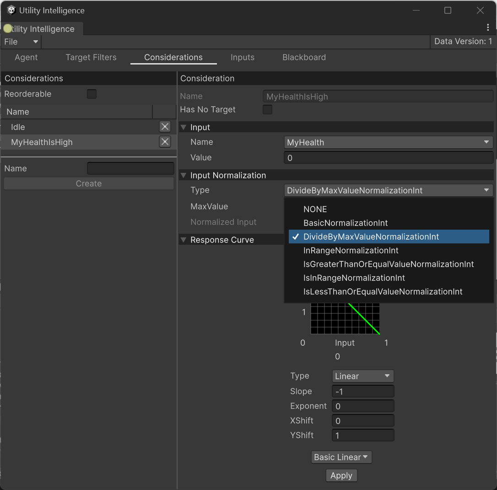
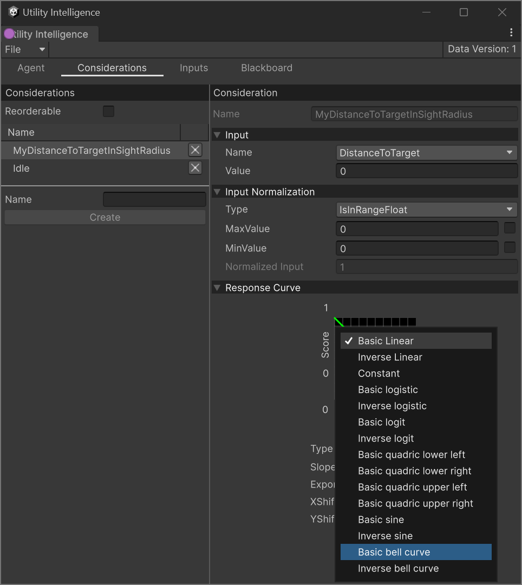

In **Utility Intelligence,** a **consideration (also called axis)** represents an aspect of the game world that influences the utility of a decision. It indicates **how appealing** the decision is at the moment and is always normalized in the range `[0, 1]`. 

For instance, suppose our agent has a decision called `AttackEnemy`, and this decision has an axis like this: **How high is my health right now?**. If the agent's health currently is `100`, then the utility of this axis will be `1.0`. It's very appealing, isn't it? However if the agent's health is just `50`, then the utility is only `0.5`. It's not as appealing anymore, right?

In addition, you can add **as many axes as you want** to a decision. That's why *Dave Mark* calls it the **Infinite Axis Utility System**. 

# Understanding how Considerations work?

A consideration is made up of:
- An [Input](.md#Inputs)
- An [Input Normalization](.md#Input%20Normalizations)
- A [Response Curve](.md#Response%20Curves)

**Input** is some knowledge about the game world that used to calculate the score of a consideration. For example, my health, target health, distance to target, etc. And it is normalized to `[0, 1]` by an [Input Normalization](.md#Input%20Normalizations).

Then the normalized input is processed through a [Response Curve](.md#Response%20Curves), which remaps the normalized input to a consideration score. These consideration scores are then multiplied together to get the final score of the decision. Therefore, if the score of any consideration is `0`, then the score of the decision will also be `0`.



# Creating Considerations

To create a new consideration, you need to go to the **Consideration Tab**, fill in the
**Name** field, and then click the **Create** button:



After create a consideration, you can select an [Input](.md#Inputs), an [Input Normalization](.md#Input%20Normalizations), and update the [ Response Curve](.md#Response%20Curves) of the consideration using **Consideration Editor**.

# Inputs

## Creating Inputs

There are two ways to create a new input:
1. Create a class inherited from `Input<Value>` and override `OnGetRawInput` method. For example:
	```cs
	public class MyDistanceToTargetInput : Input<float>
	{
	    protected override float OnGetRawInput(InputContext context)
	    {
	        var myPosition = AgentFacade.Position;
	        var targetPosition = context.TargetFacade.Position;
	        myPosition.Y = 0;
	        targetPosition.Y = 0;
	
	        return Vector3.Distance(myPosition, targetPosition);
	    }
	}
	```

2. Because each consideration is considered per target, so if the input factor exists in both **Self** and **Target** entities, then the input class should inherit from `InputFromSource<Value>`:
	```cs
	public class HealthInput : InputFromSource<int>
	{
	    protected override int OnGetRawInput(InputContext context)
	    {
	        UtilityEntity inputSource = GetInputSource(context);
	        if (inputSource.EntityFacade is Character character)
	        {
	            return character.Health.Health;
	        }
	
	        return 0;
	    }
	}
	```
- Using `InputFromSource<Value>`, you can choose the source of the input: either **Self** or **Target**:


To add inputs to the agent, you need to go to the **Input Tab**, give it a name, select the input type and then click to the **Create** button: 


To select the input for a consideration, you need to select the input name from this drop down in **Consideration Editor**:  




## Built-in Inputs

Currently, **Utility Intelligence** provides these buit-in inputs:
- **BasicInputFloat(Int/Bool)**: It returns the default value of the type at runtime and is mainly used for testing considerations
- **MyDistanceToTargetInput**: It returns the distance from the current agent to the target.

# Input Normalizations

## Creating Input Normalizations

- To create a Input Normalization, you need to create a new inherited from `InputNormalization<Value>` and override `OnCalculateNormalizedInput` method. For example:
	```cs
	public class IsInChargeRadiusNormalization : InputNormalization<float>
	{
	    public float ChargeRadius = 2;
	
	    protected override float OnCalculateNormalizedInput(float rawInput, InputContext context)
	    {
	        return rawInput >= 0 && rawInput <= GetChargeRadius(context) ? 1.0f : 0.0f;
	    }
	
	    private float GetChargeRadius(InputContext context)
	    {
	        if (context is { TargetFacade: ChargeStation chargeStation })
	            return chargeStation.ChargeRadius;
	        return ChargeRadius;
	    }
	}
	```

- To select the input normalization for a consideration, you need to select the normalization type from this drop down in **Consideration Editor**:  
	

## Built-in Input Normalizations

We provides a lot of built-in input normalizations to help you normalize your inputs **without having to write a single line of code**:
- Float
	- **BasicNormalizationFloat**: It clamps the input value to `[0, 1]`
	- **DivideByMaxValueFloat**: It divides the input by `MaxValue`.
	- **GreaterThanOrEqualValueFloat**: It returns `1` if the input value is greater than `Value`; otherwise, it returns `0`.
	- **LessThanOrEqualValueFloat**: It returns `1` if the input value is less than the `Value`; otherwise, it returns `0`.
	- **InRangeFloat**: It maps the input value from `[MinValue, MaxValue]` to `[0, 1]`.  Note that if the input value is above `MaxValue`, then the normalized value is `1`, and if the input value is below `MaxValue`, then the normalized value is `0`.
	- **IsInRangeFloat**: It returns `1` if the input value is in the range `[MinValue, MaValue]`; otherwise, it returns `0`.
- Int 
	- The integer input normalizations are similarly to the floats
- Bool
	- **BasicNormalizationBool**: It returns `1` if the input value is `true`; otherwise, it returns `0`.

# Response Curves

In **Utility Intelligence**, response curves are used to remap the normalized input to the consideration score. And it has 5 parameters:
- Curve Type
- Slope
- Exponent
- XShift
- YShift

You can change these parameters to adjust the shape of the response curve based on your needs. 

**Utility Intelligence** also provides a list of useful presets for response curves. If you want to use our presets, you just need to select one and click to the **Apply** button.



---
<p align="center">
	If you <b>find</b> this plugin <b>helpful</b>, please consider <b>supporting</b> it by leaving a <b>5-star review</b> on the Asset Store. Your <b>positive feedback</b> allows me to <b>dedicate more time</b> to its development. 
	<br>Thank you so much! 🥰
	<br><a href="https://assetstore.unity.com/packages/slug/276632"></img></a>
</p>