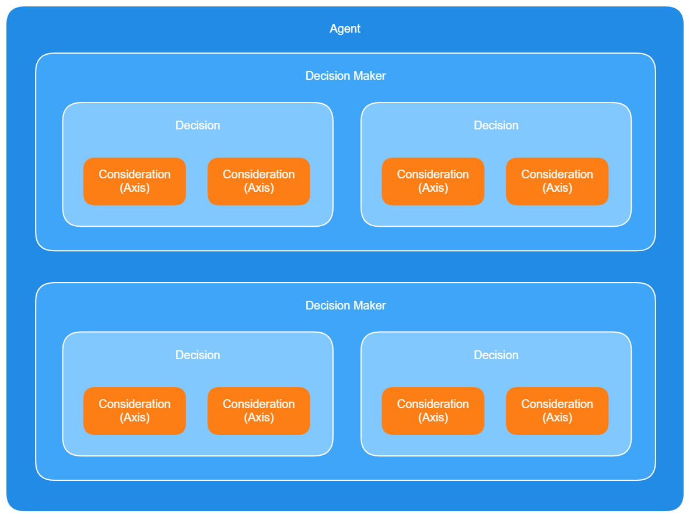
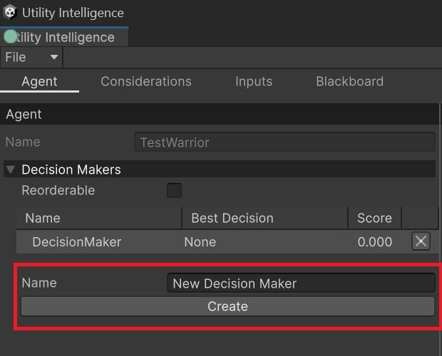

In **Utility Intelligence**, a Decision Maker contains a list of decisions, and the responsibility of each Decision Maker is to select the best decision from them based on the current situation. Additionally, each Utility Agent can contain multiple Decision Makers.

## Understanding how Decision-Making Process work?

Here's how the **Decision-Making Process** of a Utility Agent works:
1. For each Decision Maker, the Utility Agent calculates the scores of all attached decisions and selects the best decision. 
2. Afterwards, the Utility Agent compares the scores of the best decisions from each Decision Maker with each other, and the winner is the decision with the highest score.

## Creating Decision Makers

To create a Decision Maker, you need to go to the **Agent Tab**, fill in the **Name** Field, and then click the **Create** button:

