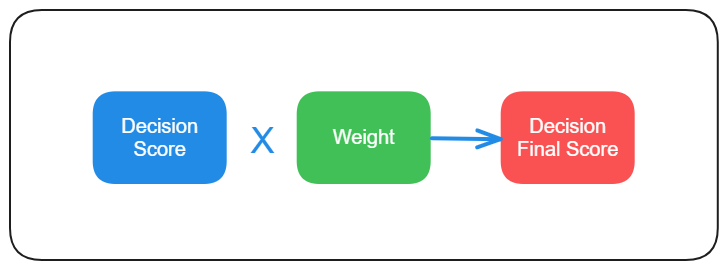
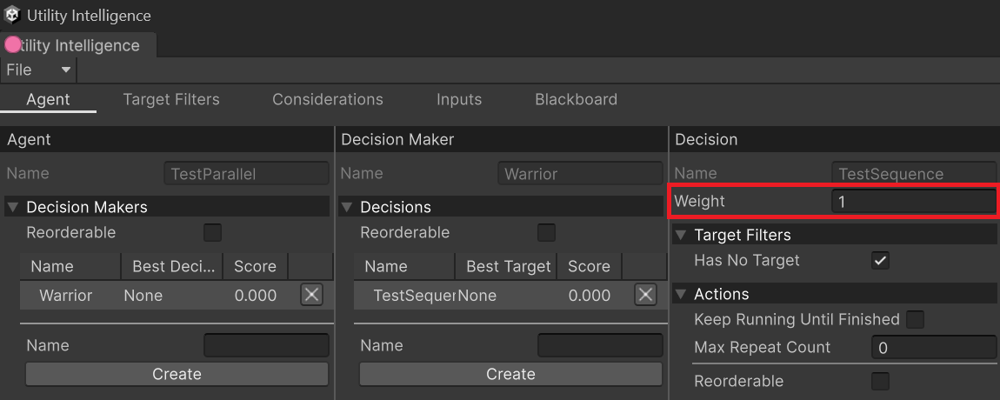
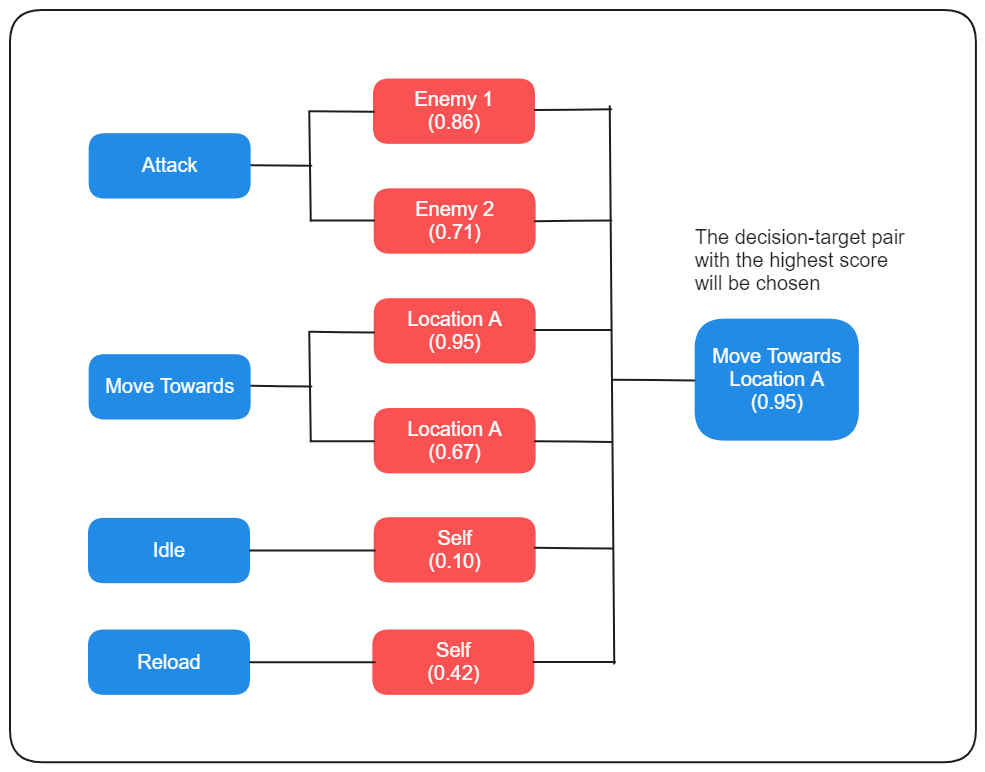
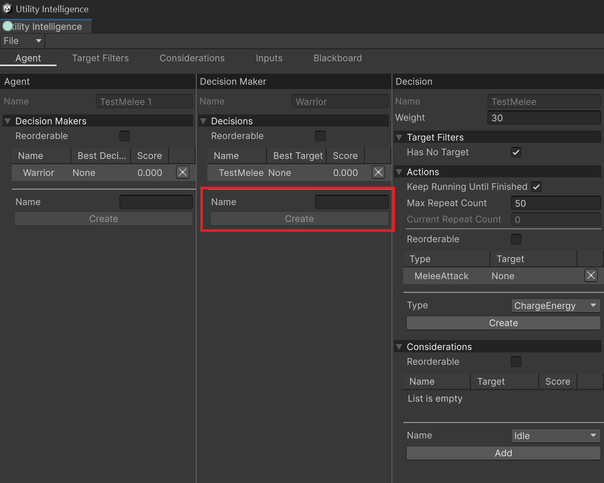

In **Utility Intelligence**, each decision has:
- A list of [Target Filters](target-filters.md): They are used to filter targets for the decision.
- A list of [Considerations](considerations.md): They are used to calculate the score of the decision.
- A list of [Action Tasks](action-tasks.md): They will be executed by the egent if the decision is chosen.

## How Decisions work?

Since a decision [is scored per target](#Decisions%20are%20scored%20per%20target), and any [Utility Entity](../UtilityWorld/utility-entity.md) (all GameObjects with `UtilityEntityOwner` or `UtilityAgentOwner` attached) in the [Utility World](../UtilityWorld/utility-world.md) could be a target of the decision, we need a way to filter targets to ensure that only appropriate targets are considered. This is the job of [Target Filters](target-filters.md).

After finding appropriate targets, all [Considerations](considerations.md) of the decision will be evaluated for each target to calculate the score of each decision-target pair. Then the score of each pair is multiplied with the [Decision Weight](#Decision%20Weight) to get the final score.

Finally, the best decision-target pair with the highest score will be chosen and the agent will execute all [Action Tasks](action-tasks.md) attached to the decision, either in **Sequence** or in **Parallel**.

### Decision Weight

In **Utility Intelligence**, you can control the prioritization of each decision by adjusting the Decision Weight. For example, you can organize your decisions into multiple layers like the following:
- Normal Layer's Weight: 1.0
- Combat Layer's Weight: 2.0
- Urgent Layer's Weight: 3.0

You can change the weight of a decision in the **Decision Editor**:

### Decisions are scored per target

A decision may or may not have targets. However:
1. If it has targets, it will be **scored per target**. Afterward, **Utility Intelligence** will compare the scores of all the decision-target pairs with each other and select the pair with the highest score.
2. If it does not have targets, it will be scored only once, and that score is the final score of the decision.

## Creating Decisions

To create a new decision, you need to go to the **Agent Tab**, fill in the **Name** field, and then click the **Create** button:

After create a decision, you can attach [Target Filters](target-filters.md), [Considerations](considerations.md) and assign [Action Tasks](action-tasks.md) to the decision using **Decision Editor**.
