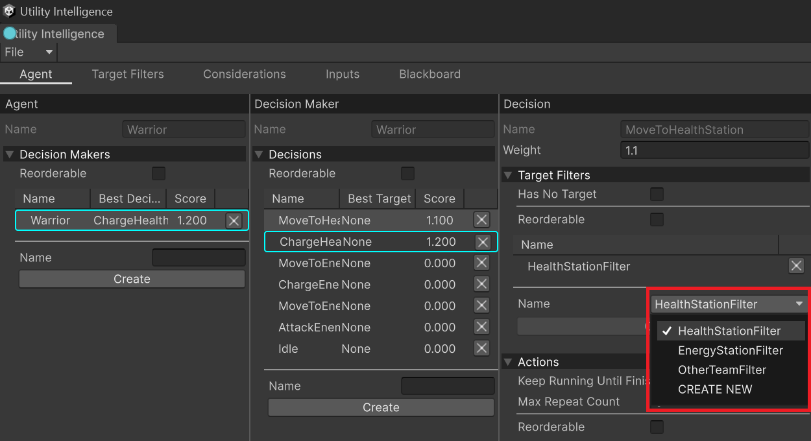

**Target Filters** are used to filter targets for the current decision. Note that a decision may or may not have Target Filters. However:
1. If the Target Filter list is empty, all utility entities in the world will be the targets for the decision.
2. If all Target Filters return no targets, then the decision will be scored only once, as if it does not have targets.


# Creating Target Filters

1. To create a new Target Filter, you need to create a class inherited from `TargetFilter` and override `OnFilterTarget` method:
	```cs
    public class ChargeStationFilter : TargetFilter
    {
        public ChargeStationType Type;

        protected override bool OnFilterTarget(UtilityEntity target)
        {
            return target.EntityFacade is ChargeStation station && station.Type == Type;
        }
    }
	```

1.  To add the Target Filter to the agent, you need to go to **Target Filter Tab**, select a target filter type, give it a name, and then click the **Create** button:


1. To attach the Target Filter to a decision, you need to go the the **Decision Editor** in the **Agent Tab**, select the Target Filter name, then click the **Add** button:


# Built-in Target Filters

Currently, we provides these built-in Target Filters:
- **OtherFilter**: The filtered targets are any entities in the utility world, except the current agent.
- **AgentFilter**: The filtered targets are any agents in the utility world.

---
<p align="center">
	If you <b>find</b> this plugin <b>helpful</b>, please consider <b>supporting</b> it by leaving a <b>5-star review</b> on the Asset Store. Your <b>positive feedback</b> allows me to <b>dedicate more time</b> to its development. 
	<br>Thank you so much! 🥰
	<br><a href="https://assetstore.unity.com/packages/slug/276632"></img></a>
</p>