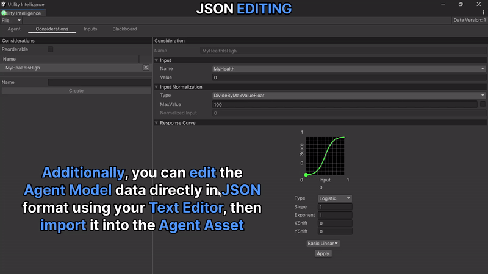
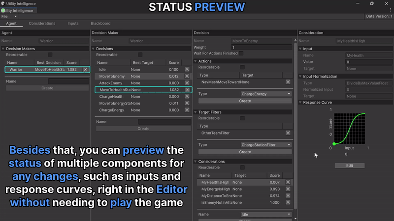
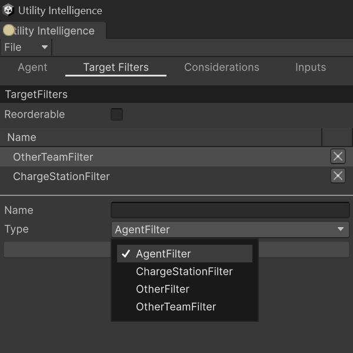
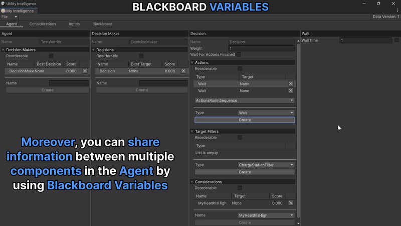

# Toolbar

## File Menu
- `Import Data`: Import the AgentModel data from a JSON file.
- `Export Data`: Export the AgentModel data to a JSON file.
- `Show Data`: Show the AgentModel data in JSON format.
- `Clear Data`: Clear all the Agent Model data.

With the File Menu Toolbar, you can edit the Agent Model data directly in JSON format using your Text Editor, then import it into the Agent Asset:

# Utility Agent Editor

## Agent Tab

In **Agent Tab**, you can add new Decision Makers, Decisions, Considerations *as many as you want*:

### Status Preview

Besides that, you can preview the status of multiple components for any changes, such as inputs, and response curves, **right in the Editor without needing to play** the game. For example:
- The score and status of each consideration, indicating which considerations are executed and discarded.
- The score and status of each decision, indicating which decision is chosen based on the current inputs, normalizations, and response curves.

I believe this feature will save a lot of your time while designing AIs for your games. 

### Runtime Status

Additionally, you can view the current status of multiple components during runtime. It is similar to Status Preview but includes additional runtime information, such as the **best target** for each decision, and the **current status** of each task.

### Runtime Editing

Moreover, you can modify AI behavior during runtime for testing purposes without needing to replay the game.

## Target Filter Tab

In **Target Filter Tab**, you can add new target filters to filter targets for each decision:

## Consideration Tab

In **Consideration Tab**, you can add new considerations and select the input, the normalization and the response curve for your considerations. Besides that, you can check how they affect the consideration score by changing them:

## Input Tab

In **Input Tab**, you can add as many Inputs as you want to the current agent:

## Blackboard Tab

In **Blackboard Tab**, you can add any type of Variable you want to share information between multiple components in your Agent:

---

	If you <b>find</b> this plugin <b>helpful</b>, please consider <b>supporting</b> it by leaving a <b>5-star review</b> on the Asset Store. Your <b>positive feedback</b> allows me to <b>dedicate more time</b> to its development. 
	 Thank you so much! 🥰
	 <a href="https://assetstore.unity.com/packages/slug/276632"></img></a>

