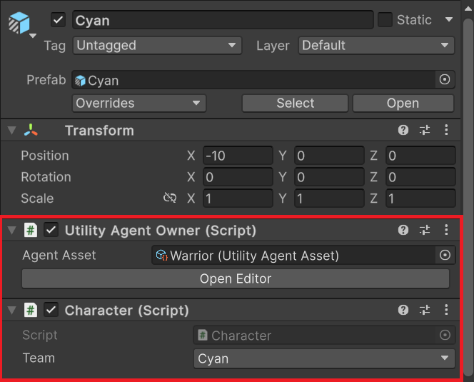
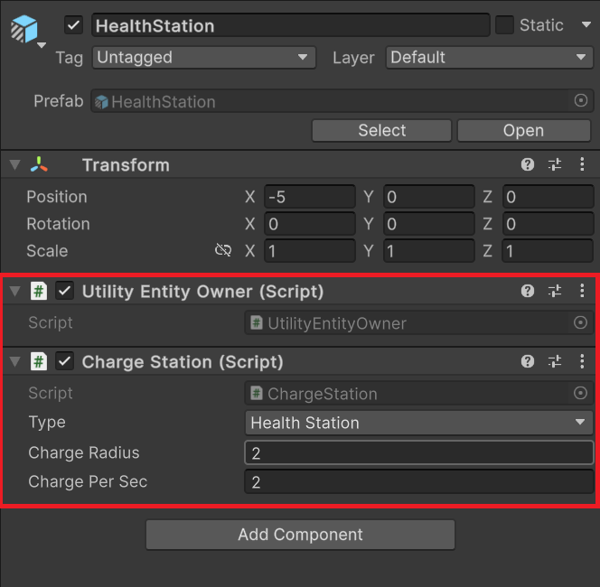
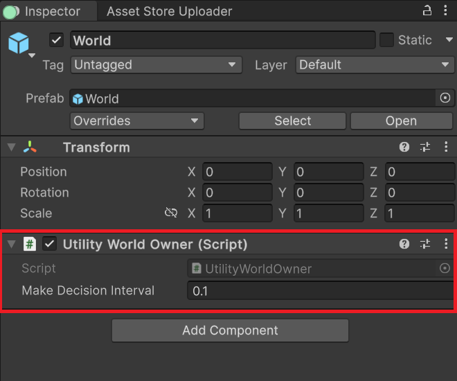

## Quick Start

1. Firstly, you need to create a **Utility Agent Asset** by right-clicking in the **Project Window** and select **Create/CarlosLab/Utility Agent Asset**.
1. Then double-click on the new **Utility Agent Asset** to open the **Editor Window**.
2. Add new [Decision Makers](UtilityAgent/decision-makers.md), [Decisions](UtilityAgent/decisions.md), [Considerations](UtilityAgent/considerations.md) *as many as you want*

1. Transform your AI GameObjects into [Utility Agents](UtilityWorld/utility-agent.md) and assign the new **Utility Agent Asset** to the **Agent Asset** field of the **Utility Agent Owner**

1. Transform all the Game Objects that your Agents need to interact with into [Utility Entities](UtilityWorld/utility-entity.md)

1. Create a [Utility World](UtilityWorld/utility-world.md) and  in your game with it.

1. Play your game.

## Running Demos in URP and HDRP

The Demos are created using Built-In Render Pipeline, so if you are using URP or HDRP, please convert all materials to the target pipeline first:

### URP
1. Open **Render Pipeline Converter** (Window -> Rendering -> Render Pipeline Converter)
2. Tick **Material Upgrade**
3. Click **Initialize and Converter** button

### HDRP
1. Open **HDRP Wizard** (Window -> Rendering -> HDRP Wizard)
2. Click **Convert All Built-In Materials to HDRP**

## Upgrade Guide

To upgrade **Utility Intelligence** you just need to do the following:
1. Backup your project
2. Remove the following folders:
	- CarlosLab/Common
	- CarlosLab/UtilityIntelligence
3. Re-import **Utility Intelligence** package

## Other Learning Resources

### Texts
1. [An Introduction to Utility Theory](https://www.gameaipro.com/GameAIPro/GameAIPro_Chapter09_An_Introduction_to_Utility_Theory.pdf), David “Rez” Graham
2. [Choosing Effective Utility-Based Considerations](https://www.gameaipro.com/GameAIPro3/GameAIPro3_Chapter13_Choosing_Effective_Utility-Based_Considerations.pdf), Mike Lewis
3. [Curvature's Wiki](https://github.com/apoch/curvature/wiki), Mike Lewis

### Videos
1. [Architecture Tricks: Managing Behaviors in Time, Space, and Depth](https://www.gdcvault.com/play/1018040/Architecture-Tricks-Managing-Behaviors-in), Dave Mark (From 33:30)
2. [Building a Better Centaur: AI at Massive Scale](https://www.gdcvault.com/play/1021848/Building-a-Better-Centaur-AI), Dave Mark and Mike Lewis