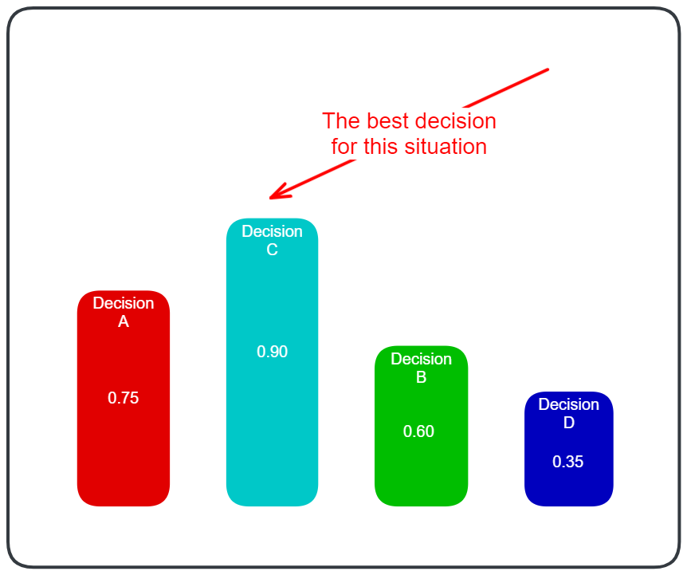

Decision-making is the core of every AI system. Various methods exist for decision-making, such as **Behavior Trees**, **Finite State Machines**, etc. Among these, **Utility AI** is one of the most robust and powerful systems for decision-making in game programming. The core concept of **Utility AI** is that every decision of an agent is assigned a **score** (also known as **utility**). And the winner is the decision with the **highest utility**.

Here's how the decision-making process of a Utility-Based AI works step by step:
1. **Evaluating decisions**
	- The AI character evaluates all decisions based on multiple factors like the enemy health, distance to target, available resources, etc.
1. **Assigning utilities for each decision**
	- Based on the evaluation, each decision is assigned a score representing its **utility**.
	- This score reflects how "good" the decision is in the current context.
1. **Making the decision**
	- The decision with the **highest utility score** is chosen for the AI character to execute.
	- This ensures the NPC prioritizes decisions that are most beneficial for the current situation.