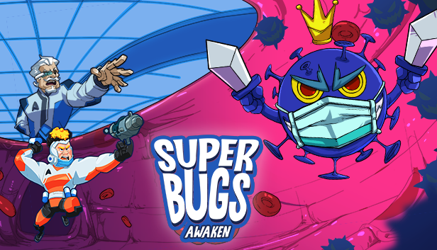

	<b>Carlos Lab</b> 
	<a href="https://discord.gg/vRFEK5uE3f"></img></a>
	<a href="https://twitter.com/carlos_truong9"></img></a>
	<a href="mailto: carlos.truong.dev@gmail.com" title="Send email to me"></img></a>

# Introduction
Hi everyone! I'm Carlos, a senior Unity game developer. I've been working for game companies for many years. However, I prefer more freedom, so currently, I am an indie dev.

I'm quite interested in techniques related to AI in games, especially Utility AI. That's the reason why I created these plugins.

# My Plugins
## Utility Intelligence
**Utility Intelligence** is the complete Utility AI solution for Unity. It implements Dave Mark's **Infinite Axis Utility System** and provides **an intuitive and user-friendly editor** that allows you to create complex AIs with ease.

**Utility Intelligence** is designed to help people develop their AIs more easily with as little effort as possible. So, it is very **easy to use & learn**.

	<b>
		<a href="https://carloslab-ai.github.io/UtilityIntelligence/#documentation">Documentation</a> - 
		<a href="https://assetstore.unity.com/packages/slug/276632">Asset Store</a>
	</b>

<iframe width="720" height="405" src="https://www.youtube.com/embed/c9rWd0I3tAU?si=F177joD9CiXrmQyo" title="YouTube video player" frameborder="0" allow="accelerometer; autoplay; clipboard-write; encrypted-media; gyroscope; picture-in-picture; web-share" allowfullscreen></iframe>

<!--

# My Indie Games

## Superbugs: Awaken
This is the first game I made as an indie dev.

	<a href="https://store.steampowered.com/app/1393570/Superbugs_Awaken">Steam Page</a>

### My team
I've created this game with my friends. Our team consists of 4 people: 1 designer, 1 artist, 1 marketer and me as an game dev. It's one of the happiest periods in my life. We have numerous unforgettable memories during the journey of developing this game, experiencing both happiness and sadness, but most of the time, it was filled with joy. I'm truly grateful for that. I'm also very happy and pround that we were able to finish and release this game.

### Gameplay
It's a Communication-Based, Co-Op game for 2 Players. You and your friend have to choose one of two roles, either as the Scientist or the Hunter. And Mimi, is your precious cat, the 3rd member of your family. Unfortunately, Mimi is seriously ill due to being infected by extremly dangerous Superbugs. Therefore, you both have to collaborate to save Mimi from the damage caused by these deadly Superbugs! 
-->

