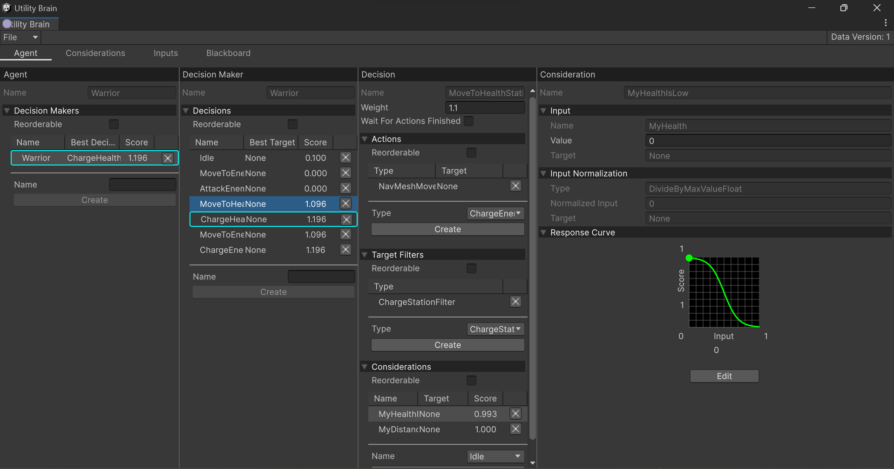

	<b>Carlos Lab</b> 
	<a href="https://discord.gg/vRFEK5uE3f"></img></a>
	<a href="mailto: carlos.truong.dev@gmail.com" title="Send email to me"></img></a>
<!--
	<a href="https://twitter.com/carlos_truong9"></img></a>
-->

# About
Hi! My name is Carlos, a senior Unity game developer. I've been working for game companies for many years. However, I prefer more freedom, so currently, I am an indie dev.

I'm quite interested in techniques related to AI in games, especially Utility AI. That's the reason why I created these plugins.

# My Plugins
## 1. Utility Brain
It is very intuitive and designer-friendly Utility AI Framework which allows you to create complex AIs with ease. It's inspired by Dave Mark's IAUS System and Mike Lewis's Curvature.

[Documentation](https://carloslab-ai.github.io/Utility%20Brain/)
[Asset Store](https://carloslab-ai.github.io/Utility%20Brain/)

## 2. Utility Map
It will be coming soon.

